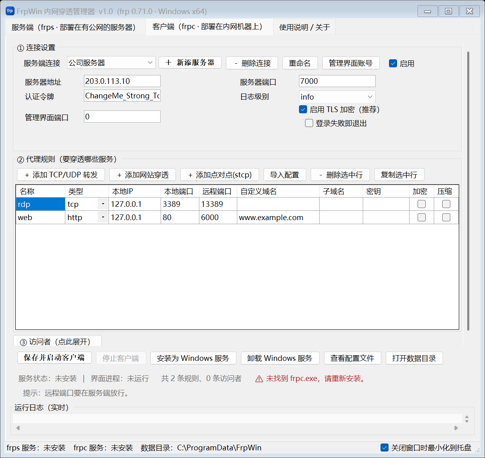

# FrpWin · Windows 内网穿透图形管理器

把 [frp](https://github.com/fatedier/frp) 包装成 Windows 原生程序的一套工具：
一个中英双语的图形管理器 + 一键安装包，装完桌面就有快捷方式，不用再手写 TOML 配置。

> 本项目是 frp 的 Windows 图形外壳，**不含 frp 源码**。
> `frps.exe` / `frpc.exe` 由脚本从 frp 官方源码编译生成。



---

## 功能

- **中英双语图形界面**（可在界面里实时切换，安装时选的语言会跟着走），
  双标签页分别管理服务端和客户端，配置不用手写
- **一个客户端同时连接多个服务端**：连接设置里「＋ 新添服务器」，
  每个连接有自己的地址 / 端口 / token / TLS / 管理界面端口 / 代理规则 / 访问者，
  启动时每个已启用连接各跑一个 frpc 进程（frp 单进程只能连一个服务端）
- **可直接导入现成的 frpc 配置**：把别的机器上的 `frpc.toml`（或老的 `frpc.ini`）
  粘进来或选进来，自动认出服务器地址、token、代理规则和访问者，选
  「新添一个服务端连接」或「并进当前连接」即可；界面外的参数
  （`healthCheck`、`metadatas` 等）原样保留，不丢配置
- **代理规则表格一眼能看 9 条以上规则**；「③ 访问者」做成可折叠
  （只在 stcp / xtcp 点对点穿透时才需要，收起时把高度让给代理表格）
- **支持 tcp / udp / http / https / stcp / xtcp 六种代理**，以及 stcp/xtcp 的 visitor
- **一键注册 Windows 服务**：`FrpWin.exe --service frps|frpc` 作为服务宿主守护 frp 子进程，
  支持开机自启、崩溃自动重启
- **一键放行 Windows 防火墙**：把界面上填的端口一次性加进防火墙
- **一键放行客户端端口**：连上服务端 Dashboard，列出**当前连上来的客户端**
  及其占用的端口，勾选后按「出站 / 进站 / 两者」批量添加防火墙规则
- **实时日志**：图形界面里滚动显示，多连接时每行带连接名前缀；服务模式下按 8 MB 自动轮转
- **内置 frp 官方 Web 管理面板**：编译时把 Vue 前端打进二进制，
  服务端开 `webServer.port` 就能用浏览器看实时连接和流量
- **单实例保护**：重复启动会把已有窗口拉到前台，不会开出一堆窗口
- **界面布局自检**：内置 `--dump-layout` / `--dump-dialog` / `--dump-texts` / `--screenshot`，
  配套自动化测试断言「按钮不截断、表头不截断、控件不重叠、英文界面无残留中文、
  默认窗口不用滚动」

---

## 快速开始

### 方式一：直接用安装包

到 [Releases](https://github.com/Ryz-z/FRP-Windows-GUI2/releases) 下载 `setup.exe`，双击安装。

- 安装到 `C:\Program Files\FrpWin\`
- 桌面生成快捷方式「FrpWin 内网穿透套装」
- 数据目录 `C:\ProgramData\FrpWin\`（配置文件与日志，卸载时保留）
- 安装时选的界面语言会写进 `C:\ProgramData\FrpWin\language.txt`
- 支持 `/CURRENTUSER` 参数安装到当前用户目录（不需要管理员权限）

### 方式二：绿色免安装

下载 Release 里的「绿色免安装版」，把三个 exe 放在同一个文件夹里，双击 `FrpWin.exe`。
注意 `FrpWin.exe` 是从**自己所在目录**找 `frps.exe` / `frpc.exe` 的，三个必须放一起。

### 五分钟跑通

1. **服务器**（有公网 IP 的机器）：打开 FrpWin → 「服务端」标签页 →
   设置 token → 「保存并启动服务端」→「放行防火墙端口」→「安装为 Windows 服务」
2. **内网机器**：打开 FrpWin → 「客户端」标签页 →
   填服务器公网 IP 和端口，token 与服务端一致 → 在「代理规则」里加一条
   （例如 `tcp` 类型、本地端口 `3389`、远程端口 `13389`）→「保存并启动客户端」
3. 在任何地方远程桌面连接 `服务器公网IP:13389` 即可

详细说明见 [`docs/使用说明.txt`](docs/使用说明.txt)。

### 一个客户端连多个服务端

「客户端」页 →「① 连接设置」那一行的工具条：

```
服务端连接 [公司服务器 ▾] [＋ 新添服务器] [－ 删除连接] [重命名] [管理界面账号] [☑ 启用]
```

- 「＋ 新添服务器」新增一个连接，它会沿用当前的 token 与 TLS 设置，地址留空等你填
- 每个连接有**自己独立的**服务器地址 / 端口 / token / TLS / 日志级别 / 管理界面端口，
  以及自己独立的代理规则表和访问者表；切换下拉框会先把当前内容存回上一个连接，
  再把新连接读出来，来回切不丢东西
- 点一次「保存并启动客户端」，会给每个**已启用**的连接各起一个 frpc 进程，
  状态栏显示「运行中 2/3 个连接 (PID …)」，日志每行带连接名前缀 `[家里 NAS] …`
- 配置文件按连接依次命名为 `frpc.toml` / `frpc-2.toml` / `frpc-3.toml`，
  连接数变少时多余的会被自动删掉
- 旧版单连接配置会自动迁移成「服务器 1」，代理与访问者一条不丢

### 导入现成的 frpc 配置

手上有别的机器导出的 `frpc.toml`（或者老版本的 `frpc.ini`）时，不用照着一条条重敲：

1. 「客户端」页 →「② 代理规则」那一行点 **「导入配置」**
2. 在弹出的窗口里：
   - 点「选择配置文件…」挑一个文件，或点「读取本机已保存的配置」
     从 `C:\ProgramData\FrpWin` 里挑，**或者直接把配置内容粘进文本框**；
   - 粘进去就会自动识别，下面会显示「识别到服务器：x.x.x.x:7000」
     「识别到 N 条代理规则、M 条访问者」；
3. 选**「新添一个服务端连接」**（连同服务器地址、token 一起建成一个新连接）
   或**「并进当前连接」**（只把规则并进来），点「导入」
4. 回到客户端页点「保存并启动客户端」

识别范围与兼容性：

| 项目 | 说明 |
|---|---|
| 服务端信息 | `serverAddr` / `serverPort` / `auth.token` / `transport.tls.enable` / `log.level` / `loginFailExit` / `webServer.*` |
| 规则 | 全部 `[[proxies]]`（tcp / udp / http / https / stcp / xtcp）与 `[[visitors]]` |
| 键名写法 | 点号键 `transport.tls.enable` 与下划线键 `server_addr` 都认 |
| 老版 INI | `[common]` + `[ssh]` 这种段落也认，段落类型由段内 `type` 键决定，没有 `name` 时自动补 `auto-tcp1` |
| 包含文件 | `includes` 递归展开（相对路径按配置文件目录解析，带环路保护，最多 5 层） |
| 数组写法 | `customDomains = ["a.com","b.com"]` 与逗号串都能读 |
| 界面外的参数 | `healthCheck.*`、`loadBalancer.*`、`metadatas`、`transport.protocol` 等原样保留，生成配置时照写 |
| 重名规则 | 自动改名（`name` → `name_2`），不覆盖已有规则 |

命令行也能单独验证解析结果：

```powershell
FrpWin.exe --import-frpc C:\path\to\frpc.toml
# CONN|203.0.113.10|7000|1|token...|1|true|1|warn|false|7400
# PROXY|rdp|tcp|127.0.0.1|3389|13389||||true|false
# PEXTRA|nas-http|healthCheck.type = "http"
# VISITOR|visitor-db|stcp|p2p-db|secret|127.0.0.1|13306
```

### 界面语言

| 优先级 | 来源 |
|---|---|
| ① | 界面里明确选过的（「使用说明 / 关于」页 →「界面语言」→「保存语言」） |
| ② | `C:\ProgramData\FrpWin\language.txt`（安装程序按你选的语言写） |
| ③ | 系统界面语言 |

---

## 从源码构建

### 环境要求

| 用途 | 需要 |
|---|---|
| 编译图形管理器 | .NET SDK 6 或更高（Windows） |
| 编译 frp | Go 1.25+ |
| 构建 frp Web 管理面板 | Node.js 18+ |
| 打包安装程序 | [Inno Setup 6](https://jrsoftware.org/isdl.php) |
| 运行脚本 | Windows PowerShell 5.1（系统自带） |

### 构建步骤

```powershell
git clone https://github.com/Ryz-z/FRP-Windows-GUI2
cd FRP-Windows-GUI2

# 1) 下载 frp 源码并编译出 frps.exe / frpc.exe（含 Web 管理面板）
.\scripts\fetch-frp.ps1

# 2) 编译图形管理器 + 打安装包 + 组装 dist 目录
.\scripts\build.ps1
```

产物在 `dist\`：
```
dist/
├── setup.exe                安装程序
├── 使用说明.txt
├── README.en.txt
├── 更新说明.txt
├── SHA256校验值.txt
└── 绿色免安装版/
    ├── FrpWin.exe
    ├── frps.exe
    ├── frpc.exe
    └── conf/                示例配置
```

只想编译图形管理器、不打安装包：

```powershell
.\scripts\build.ps1 -SkipInstaller
```

`fetch-frp.ps1` 的参数：

| 参数 | 作用 |
|---|---|
| `-Force` | 已下载/已编译过也重新来一遍 |
| `-SkipWeb` | 跳过前端构建（`frps` 将没有 Dashboard 页面，但体积小、不需要 Node） |
| `-GoProxy <url>` | 换 Go 模块代理，默认 `https://goproxy.cn,direct` |
| `-SourceUrl <url>` | 自定义 frp 源码包地址（默认会依次尝试 codeload / github / 加速代理） |

> **关于安装包的中文界面**
> Inno Setup 自带的语言文件里没有简体中文。想要中文安装向导，请下载
> [ChineseSimplified.isl](https://github.com/kira-96/Inno-Setup-Chinese-Simplified-Translation)
> 放到 `<Inno Setup 安装目录>\Languages\` 下。
> 没放也没关系 —— 脚本会自动只编译英文版安装程序，不会构建失败。

---

## 命令行参数

`FrpWin.exe` 除了双击打开图形界面，还支持：

| 参数 | 作用 |
|---|---|
| `--service frps\|frpc` | 作为 Windows 服务宿主运行（由服务控制管理器调用，不要手工执行） |
| `--run frps\|frpc` | 前台运行，日志直接刷在控制台，便于排错 |
| `--gen-config` | 按当前设置重新生成全部 `frps.toml` / `frpc*.toml` 后退出 |
| `--dump-layout [语言] [--expand-visitors]` | 打印界面所有控件的真实位置尺寸（`--expand-visitors` 额外导出③访问者展开后的布局） |
| `--dump-dialog <clients\|ports\|import> [语言]` | 打印「放行客户端端口」两个对话框和「导入配置」对话框的布局 |
| `--dump-texts zh\|en\|auto` | 按指定语言导出界面上全部可见文字（英语模块回归用） |
| `--probe-frps <端口> [用户] [密码] [语言]` | 连服务端 Dashboard，打印客户端与端口清单 |
| `--import-frpc <文件>` | 解析一份 frpc 配置并打印识别结果（导入功能的回归用） |
| `--screenshot <png> [页] [语言] [demo]` | 把界面渲染成 PNG（页：0=服务端 1=客户端 2=关于） |
| `--screenshot-dialog <png> <clients\|ports\|import> [语言]` | 把对话框渲染成 PNG |

---

## 测试

```powershell
.\scripts\verify-all.ps1
```

会依次跑（共 261 项断言）：

| 套件 | 断言数 | 内容 |
|---|---|---|
| `e2e-test.ps1` | 14 | 真机跑通 frps + frpc，验证隧道、Dashboard、真实 API 形状、错误 token 被拒绝 |
| `test-layout.ps1` | 62 | 界面布局：控件不重叠、文字不截断、代理表格能显示 8 行以上、③访问者折叠/展开两种状态、导入对话框、对话框不越界 |
| `test-config.ps1` | 40 | 六种代理 + visitor、多连接各生成各的 TOML，交给 `frpc verify` 校验；老配置迁移 |
| `test-runmode.ps1` | 9 | 进程管理、日志落盘、子进程关系（同 Windows 服务宿主代码路径） |
| `test-installer.ps1` | 32 | 中/英文各静默安装一次 → 校验说明书与快捷方式 → 启动程序验语言 → 卸载 |
| `test-i18n.ps1` | 23 | 翻译表静态覆盖 + 占位符一致 + 英文模式零中文（含导入对话框）+ 语言优先级 |
| `test-import.ps1` | 39 | 导入 frpc 配置：TOML / 老版 INI / `includes` 展开 / 界面外参数保留 / 坏输入不崩 |
| `test-firewall-api.ps1` | 45 | 用 `mock-frps.ps1` 假 Dashboard 验证认证、JSON 解析、端口清单、规则名生成 |

没有装 Inno Setup 时会自动跳过打包与安装测试。

单独的套件也可以直接跑，例如 `.\scripts\test-layout.ps1`。

---

## 工程结构

```
.
├── src/FrpWin/              C# 图形管理器（.NET Framework 4.8，WinForms）
│   ├── Program.cs           入口：GUI / --service / --run / --gen-config / 各种自检开关
│   ├── MainForm.cs          主窗口、服务端页、托盘、服务安装、语言切换
│   ├── MainFormClient.cs    客户端页、多连接工具条、代理表格、导入入口、配置校验与保存
│   ├── FrpcConfigFile.cs    解析现成的 frpc 配置（TOML / 老版 INI / includes）
│   ├── FrpcImportForm.cs    「导入 frpc 配置」对话框
│   ├── ClientFirewallForms.cs  「一键放行客户端端口」的两个对话框
│   ├── Loc.cs / LocTable.cs 多语言：翻译表与控件树静态文字替换
│   ├── FrpsApi.cs / Json.cs 读取 frps Dashboard API 的最小 HTTP + JSON 解析
│   ├── Firewall.cs          用 netsh 生成/添加防火墙规则
│   ├── Toml.cs              把设置渲染成 frp 的 TOML
│   ├── FrpRunner.cs         启动/停止 frp 子进程并抓取实时日志（支持多连接多进程）
│   ├── FrpService.cs        Windows 服务宿主
│   └── ServiceManager.cs    用 sc.exe 管理服务
├── installer/FrpWin.iss     Inno Setup 脚本
├── installer/assets/        使用说明（中/英）、示例配置、图标
├── scripts/                 构建与测试脚本
│   ├── config.ps1           公共路径与工具函数（所有路径都相对仓库推导）
│   ├── fetch-frp.ps1        下载并编译 frp 官方源码
│   ├── build.ps1            编译 + 打包 + 组装 dist
│   ├── verify-all.ps1       全量验证
│   └── i18n/                翻译表源数据与生成脚本的输入
└── docs/                    使用说明与界面截图
```

### 一些实现上的注意点

- **界面用 .NET Framework 4.8**：Windows 10/11 自带运行时，用户不需要额外装 .NET，
  编译出来的 exe 只有 190 KB 左右。
- **一个客户端连多个服务端 = 多个 frpc 进程**：`ClientCommonConfig` 只有一组
  `serverAddr` / `serverPort`，`includes` 也只是把多个文件合并进同一个客户端，
  frp 本身不支持一个 frpc 连多个服务端。所以这里每个连接生成一份独立的
  `frpc-N.toml` 并各起一个进程。
- **真实 frps 的 `/api/proxy/tcp` 里没有 `localPort`**：`ProxyBaseConfig.LocalPort`
  带 `omitempty` 且 frps 根本不记录它，只有 `localIP` 有默认值。所以「一键放行
  客户端端口」的说明列必须自己兜底，不能指望这个字段。这个坑只有真跑
  frps + frpc 才能发现，mock 数据也必须照着真实返回体来写。
- **代理与客户端的关联用 `clientID`**（等于 `ClientInfo.RawClientID` 或 `RunID`），
  取不到时才退回 `user`。
- **表头高度必须跟着字体算**：DataGridView 在控件构造时就把表头高度算好并锁死，
  那时用的还是系统默认字体；等控件挂到窗体继承 9pt 微软雅黑后字体变高，
  锁死的高度不跟着变，表头文字就会被纵向截掉。所以这里用 `AutoSize` +
  按 `TextRenderer` 实测文字高度算行高。
- **按钮不要写死宽度**：高 DPI 下固定宽度会把文字裁掉，统一用 `AutoSize`。
- **表格上方的按钮条不要用 `Dock` + `BringToFront`**：z 序会乱，
  按钮条会盖住表格表头。改用 `TableLayoutPanel` 明确分行。
- **单列 `TableLayoutPanel` 一定要写 `ColumnStyles`**：不写时单列会退化成
  `AutoSize`，某一个过宽的兄弟控件会把整列撑到窗体之外。
- **`FlowLayoutPanel` 配 `AutoSize` + `Dock=Fill` 会算错高度**：它先按一行算高，
  之后才按实际宽度折行，第二个单选项就会压住下面的按钮。
- **翻译表以中文原文为键**：源码里照旧写中文，`Loc.Apply(Control)` 在建好窗口后
  整棵控件树替换；拼串的地方用 `Loc.F(zh, args)`。这样新增文案时漏翻译能被
  测试抓出来（静态覆盖 + 运行期零中文两道断言）。
- **含中文的 `.ps1` / `.iss` / `.txt` 必须存成 UTF-8 with BOM**：
  否则 PowerShell 5.1 会按 GBK 解析导致语法错误，Inno Setup 会显示乱码。
- **PowerShell 5.1 的 `“”` 会被当成字符串定界符**，写测试断言时用「」代替。
- **PowerShell 变量不区分大小写**：`$ZH` 与 `$zh` 是同一个变量，容易被静默覆盖。

---


## 授权与致谢

- 本项目的图形外壳代码采用 [Apache License 2.0](LICENSE)
- [frp](https://github.com/fatedier/frp) 版权归 fatedier 所有，同样采用 Apache License 2.0
- 本仓库不包含 frp 源码；`frps.exe` / `frpc.exe` 由 `scripts/fetch-frp.ps1`
  从 frp 官方源码编译得到，构建产物同样遵循 Apache License 2.0

详见 [NOTICE](NOTICE)。
